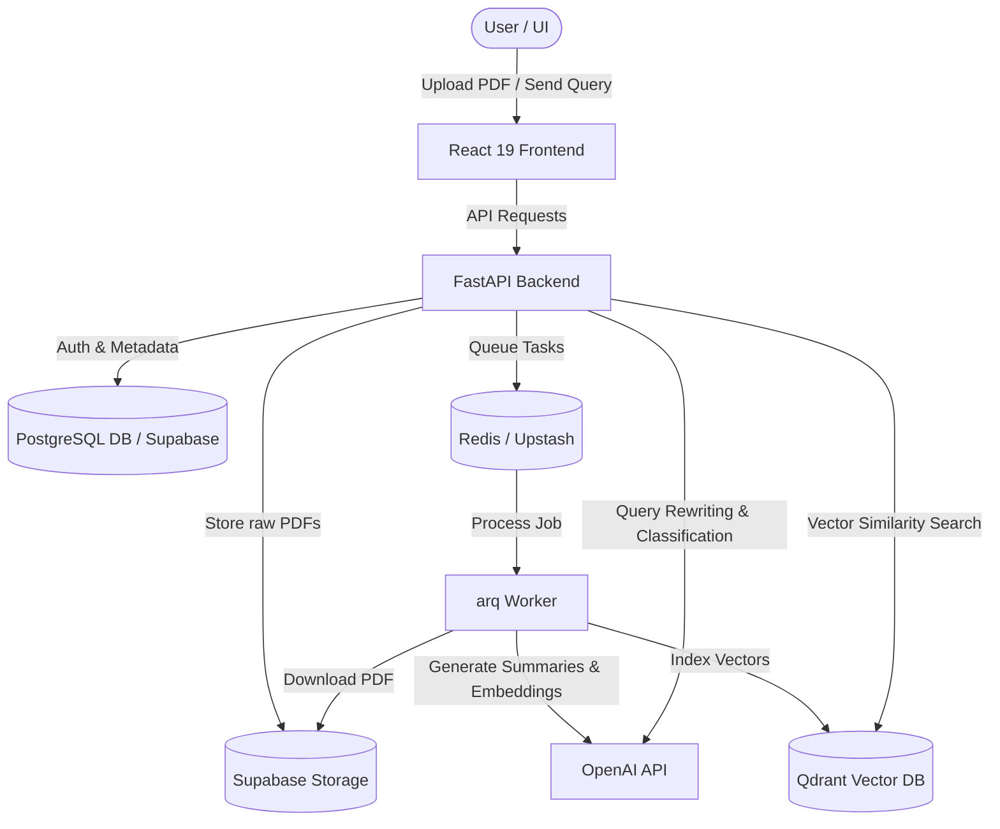

# RAG-space: Advanced Retrieval-Augmented Generation Platform

RAG-space is a high-performance, multi-tenant Retrieval-Augmented Generation (RAG) platform that enables users to build custom AI workspaces ("Apps"), upload PDF documents, index them, and chat with their knowledge base in real-time.

---

## 🚀 System Architecture & How It Works

RAG-space is split into two primary components: a responsive, premium React frontend dashboard (`RAGspace`) and a robust FastAPI backend API (`RAG-FASTAPI-Learning`). 



### 1. Document Ingestion Pipeline (Asynchronous)
1. **Upload**: A user uploads a PDF file via the frontend dashboard.
2. **Metadata & Storage**: The backend receives the file, saves the document metadata (status: `uploaded`) to PostgreSQL, and uploads the binary file to **Supabase Storage** (under the user's isolated workspace folder).
3. **Queue Task**: The backend enqueues a background job via **Redis** using the `arq` task runner.
4. **Processing Worker**:
   - The `arq` worker downloads the PDF from Supabase Storage.
   - Extracts page-by-page text using **PyMuPDF**.
   - Sends the full text to **OpenAI GPT-4o-Mini** to generate a highly searchable, semantic summary.
   - Creates embeddings for the summary and upserts them to the **Qdrant Vector DB** collection tagged as `document_summary`.
   - Divides pages into semantic chunks, creates embeddings using OpenAI's embedding API, and upserts them to **Qdrant** with metadata payload (`user_id`, `app_id`, `document_id`, `page_number`, etc.).
   - Updates the database document status to `processed` (or `failed` in case of errors).

### 2. Conversational Search & Query Workflow
1. **Query**: The user asks a question in the chat interface.
2. **Context Resolution**: The backend rewrites the question into a standalone query using OpenAI GPT-4o-Mini by analyzing the last 10 messages of conversational history to resolve references/pronouns.
3. **Classification**: The query is classified into:
   - `document` level: e.g., asks for summaries, document overviews, or "what files are uploaded".
   - `chat` level: queries looking for specific details within the text chunks.
4. **Vector Retrieval**:
   - The query is converted into an embedding.
   - A filtered vector query is sent to **Qdrant**, filtered strictly by the current `user_id` and `app_id` to guarantee tenant isolation.
   - Matches are filtered using a minimum similarity score (default: `0.5`).
5. **LLM Synthesis**: The retrieved chunks/summaries are formatted as context and passed along with the conversation history to OpenAI GPT-4o-Mini. The model streams the answer back to the frontend.
6. **Chat Persistence**: The exchange is stored in the PostgreSQL database.

---

## 🛠️ Full Infrastructure Stack

RAG-space uses a modern, serverless-friendly cloud infrastructure:

| Component | Technology | Description |
| :--- | :--- | :--- |
| **Frontend UI** | React 19 + TypeScript + Vite | Rich user interface using TailwindCSS v4, Framer Motion animations, TanStack Query for state sync, and React Router v7. |
| **Backend API** | FastAPI + Python | High-performance, async Python web framework using SQLAlchemy and Alembic. |
| **Metadata DB** | Supabase (PostgreSQL) | Stores users, workspaces ("apps"), document tracking stats, and full conversation/message logs. |
| **File Storage** | Supabase Storage | Houses raw PDF files in isolated user/app storage directories. |
| **Vector DB** | Qdrant Cloud | Performs ultra-fast cosine similarity searches over document text and summary embeddings. |
| **Task Queue** | Redis (Upstash) + `arq` | Handles background file downloads, extraction, summary/embedding generation, and vector indexing. |
| **AI / LLM** | OpenAI API | Powers query rewriting, semantic text embeddings, document classification, summaries, and chat synthesis. |
| **Authentication** | Supabase Auth | Provides secure email-and-password sign-in and authorization tokens. |

---

## ⚙️ Installation & Setup

### Prerequisites
- **Node.js** (v18+ recommended)
- **Supabase Account** (Project URL and Anon Key)

---

### Frontend Setup (`RAGspace`)

1. **Navigate to the Frontend Directory**:
   ```bash
   cd RAGspace
   ```

2. **Install Dependencies**:
   ```bash
   npm install
   ```

3. **Environment Variables**:
   Create a `.env` file in the frontend directory using the template:
   ```bash
   cp .env.example .env
   ```
   Ensure the variables are configured correctly:
   - `VITE_API_URL`: Points to your backend (default is `http://localhost:8000`).
   - `VITE_SUPABASE_URL`: Your Supabase project URL.
   - `VITE_SUPABASE_ANON_KEY`: Your Supabase anonymous client key.
   - `VITE_DEMO_EMAIL` / `VITE_DEMO_PASSWORD`: Demo credentials for quick authentication bypass (see details below).

4. **Start the Dev Server**:
   ```bash
   npm run dev
   ```

---

## 💡 Additional Features

### Demo Credentials Mode
To make evaluation and testing friction-free, a Demo mode is integrated into the landing and login interfaces.
- Demo credentials can be configured in the frontend `.env` via `VITE_DEMO_EMAIL` and `VITE_DEMO_PASSWORD`.
- Clicking "Demo Login" automatically signs in the user using the configured demo credentials.
- Visual alerts and information cards are dynamically rendered to guide testing users.

### Data Deletion & Cleanup
When a user deletes a document or an entire application workspace:
- All related chunks and summaries are deleted from Qdrant by matching the `document_id` or `app_id` metadata keys.
- The raw PDF file is purged from Supabase Storage.
- Relational tables cascade-delete records from PostgreSQL, leaving no orphaned data.
